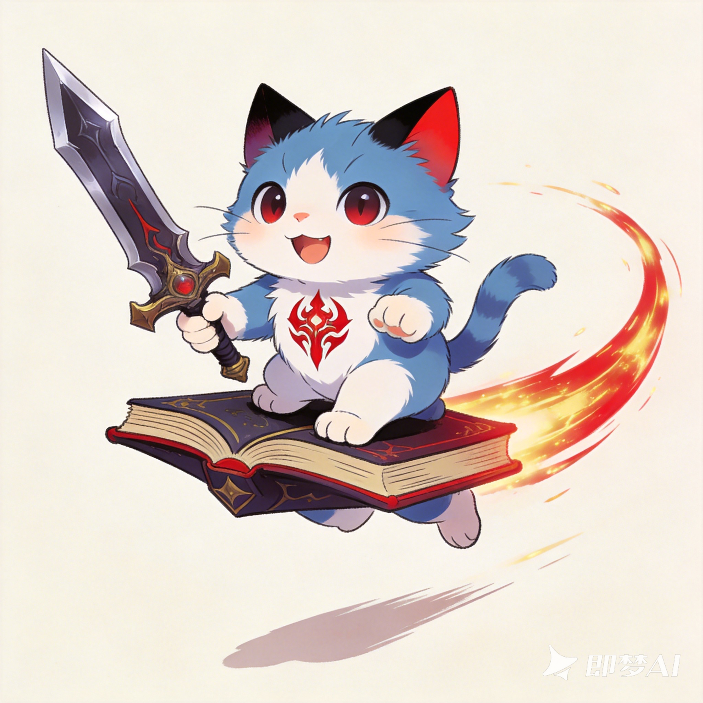

# drink_or_not

一只坐在魔法书上的猫,常驻桌面,定时用气泡提醒你照顾自己:喝水、上厕所、吃饭、休息、
摸鱼,18:00 提醒写日报。对**喝水**和**上厕所**还会盯着鼠标空闲时长,判断你是不是真的
离开工位去做了。



## 环境要求

- Python 3.9(用 uv 管理,**不要**直接用系统的 `python`)
- [uv](https://docs.astral.sh/uv/)
- Linux 需要 X11 会话,或装了 XWayland 的 Wayland 会话(原因见「已知限制」)
- macOS 的移植缺口已补齐,但**还没在真机上跑过**;剩下哪些项要在 Mac 上确认、
  怎么确认,见 `uv run python script/check_env.py --hold` 末尾打印的肉眼核对清单

## 安装与运行

```bash
uv sync

# 首次运行需要先生成素材(原图没有 alpha 通道,必须先抠背景)
uv run python script/prepare_assets.py
uv run python script/generate_frames.py

uv run drink-or-not
```

启动后猫会出现在屏幕右下角方向。`-v` 打印调试日志。

## 怎么用

| 操作 | 效果 |
|---|---|
| 左键拖动 | 把猫挪到任意位置,松手记住;重启后恢复 |
| 左键点气泡按钮 | 「知道了」收起气泡;「5 分钟后再提醒」推迟一次 |
| 右键 | 菜单:更换形象 / 设置 / 帮助 / 立即测试提醒 / 退出 |
| 托盘图标单击 | 显示或隐藏宠物 |
| 托盘图标右键 | 今日完成情况、显示/隐藏、立即测试提醒、设置、帮助、退出 |

**点掉气泡不会中断判定**。气泡只是通知,判定在后台继续跑完整个观察窗口。

## 换成自己的形象

右键 →「更换形象」→「导入图片…」,选一张 png / jpg / jpeg / bmp / webp 就行。程序在本地跑
一遍抠背景 + 生成摇摆动画,存进素材库,然后立刻切过去,不用重启。

导入时会自动检查抠图结果,不合适就说明原因,并给三个选择:**重新选择图片** /
**整图显示**(不抠背景,整张图当形象) / **放弃**。

- 图片**自带透明通道**时(比如已经抠好底的 PNG)**直接采用 alpha,不做抠图** —— 这是最稳的
  路子,有条件就用透明底图。
- 抠图只认「背景大致均匀、且与图片边缘连通」的图,**复杂背景的照片基本抠不动**,请走
  「整图显示」。
- 内置的「魔法猫」不能改名也不能删;自己导入的可以重命名、删除。
- 正在使用的形象被删掉时会自动退回内置形象。
- 托盘菜单里有同一套「更换形象」,宠物被拖出屏幕时也能换。

形象存在配置目录的 `sprites/` 下,一个目录一个形象,里面是 `manifest.json`、`frames/` 和
导入时的原图(`source.png`)。不随应用升级迁移,换机器要手动搬。

## 提醒项与默认值

| 项目 | 默认间隔 | 判定"是否真去做了" | 静止阈值 | 观察窗口 |
|---|---|---|---|---|
| 💧 喝水 | 45 分钟 | ✅ | 20 秒 | 5 分钟 |
| 🚽 上厕所 | 60 分钟 | ✅ | 120 秒 | 5 分钟 |
| 🍚 吃饭 | 240 分钟 | ❌ | — | — |
| 😴 休息 | 90 分钟 | ❌ | — | — |
| 🐟 摸鱼 | 60 分钟(**默认关**) | ❌ | — | — |
| 📝 日报 | 每天 18:00 | ❌ | — | — |
| 🔌 启动语 | 每次启动 | ❌ | — | — |

全部可在设置窗口里改。另外有「免打扰时段」(默认关,22:00–08:00)和「开机自启」。

### "是否真去做了"是怎么判的

只看一个信号:**全局鼠标空闲了多久**。人起身去接水,鼠标必然静止一段时间。

难点在提醒弹出的那一刻,用户往往**本来就**处于静止状态(正在看代码、看文档,鼠标几十秒
没动是常态)。所以不能只看"空闲 ≥ 阈值",否则弹出瞬间就误判成完成;也不能要求"静止完全
发生在弹出之后",因为那在这种常见情况下永远不成立。

实际口径是**只统计提醒之后新增的静止时长**。弹出时记下当前空闲秒数作为基准:

```
fresh = idle - 基准    (idle ≥ 基准,说明一直没输入,静止在连续累加)
fresh = idle           (idle < 基准,说明中途有输入,已经被重置成新的一段)
fresh ≥ 阈值  →  记为完成
```

观察窗口到期还没攒够,记为未完成。

> **这是启发式的,一定会误判。** 坐着不动鼠标超过阈值会被算成"去了"——喝水默认 20 秒,
> 意味着盯着屏幕发呆 20 秒也会记一次完成。反过来说,起身时手蹭到鼠标就不算。如果你觉得
> 误判太多,把「算作去过」的秒数调大(比如 90–180 秒)再试。
>
> 不引入额外依赖的前提下,精度上限就在这里。

## 配置文件与记录

都在平台标准目录下:

| 平台 | 路径 |
|---|---|
| Linux | `$XDG_CONFIG_HOME/drink_or_not/`(默认 `~/.config/drink_or_not/`) |
| Windows | `%APPDATA%\drink_or_not\` |
| macOS | `~/Library/Application Support/drink_or_not/` |

- `config.json` —— 首次运行就会生成,可直接手改(改完重启生效)
- `records.jsonl` —— 一行一条 JSON,`fired` 是弹出,`judged` 是判定结果
- `sprites/` —— 导入的形象,一个目录一个;内置的 `default` 不在这里,它是随包的只读资源
- `drink_or_not.log` —— 日志,超过 1MB 自动轮转

```json
{"ts": "2026-09-16T13:24:28+08:00", "item": "water", "event": "fired"}
{"ts": "2026-09-16T13:24:31+08:00", "item": "water", "event": "judged", "outcome": "completed"}
```

## 自检脚本

```bash
uv run python script/check_env.py     # 环境自检:平台插件、透明、遮罩、空闲检测等
uv run drink-or-not --debug-idle      # 打印命中的空闲检测来源,连采 6 秒
uv run python script/e2e_test.py      # 调度→判定→记录→托盘统计 的端到端冒烟
uv run python script/ui_test.py       # 设置窗口 / 自启 / 气泡命中 / 窗口遮罩 / 素材库 的冒烟
```

自检的逻辑本体在 `src/drink_or_not/selfcheck.py`,**打包产物里跑的是同一份**,所以到了
没有仓库、没有 uv 的目标机上照样能逐项验:

```bash
drink-or-not --self-check          # 打包产物:同样的检查
drink-or-not --self-check --hold   # 自检完不自动退出,方便看那只猫
```

自检结果有四种状态:`PASS` / `FAIL` / `WARN` / `SKIP`。**`SKIP` 不等于通过** —— 它是
"本平台测不了",会被单独列出来,不会混进通过数里凑数。末尾还会打印一份只能肉眼确认的
清单(窗口失活、全屏浮层、托盘左键语义、Retina 遮罩对齐……)。

`--debug-idle` 是排查"为什么判定一直不通过"的第一站。采样时别碰鼠标,数值应该稳步上涨;
出现 `↓ 有输入!` 就说明有东西在持续产生输入事件。

## 打包

```bash
bash build/build_linux.sh          # Linux → dist/drink_or_not
build\build_windows.bat            # Windows → dist\drink_or_not.exe
bash build/build_macos.sh          # macOS → dist/drink_or_not.app
```

**PyInstaller 不能交叉编译。** 它打包的是宿主的解释器和原生库,所以在 Ubuntu 上产不出
Mach-O —— Mac 的包只能在 Mac 上打。这也是为什么产出的东西能自包含,以及为什么 uvbox
(见下)是个绕路方案。

PyInstaller 的入口是 `build/entry.py`,**不是** `src/drink_or_not/__main__.py`。后者被当成
顶层脚本执行时,里面的 `from .config import ...` 找不到父包,冻结后一启动就 ImportError;
更隐蔽的是模块分析也随之失效 —— 整个包连带 Pillow 都不会被打进包体,产物看着挺大却一跑就崩。
`entry.py` 用绝对导入做薄壳绕开这点。

### 分发给别人(macOS)

`build_macos.sh` 产出 `dist/drink_or_not.app` —— **自包含**的外壳:解释器、Qt 库、assets 全
在里面。对方双击就能开,**不需要联网、不需要装 uv、不需要开终端**。这是它和 uvbox 那个路线的
根本区别。

```bash
cd dist && zip -qry drink_or_not-macos-$(uname -m).zip drink_or_not.app
```

- **必须整个 `.app` 目录一起压**(`zip -r` / `tar`,别在 Finder 里只拖里面那个二进制),
  否则可执行权限和内部符号链接会丢。
- 名字里带上 `$(uname -m)`:包是 `arm64` 还是 `x86_64` 取决于你打包那台机器,**两者互不通用**
  (Intel 的 Mac 跑不了 arm64 的包)。

对方那边:

```bash
unzip drink_or_not-macos-arm64.zip
xattr -dr com.apple.quarantine drink_or_not.app
open drink_or_not.app
```

`xattr` 那行是拆 Gatekeeper 的隔离标记。没签名也没公证的产物,对方从浏览器/微信/AirDrop
收到后系统会拦一次("无法验证开发者"),`xattr` 或右键→「打开」都能放行;**想彻底消掉这个提示
只能买 Apple Developer 账号做签名 + 公证,没有免费替代**。

Info.plist 里两个值得知道的点:

- `NSHighResolutionCapable` —— Retina 的关键。不写这条,整个应用会跑在低分辨率放大模式里,
  猫是糊的;而且自检判不出来(只有肉眼能看出来)。
- **刻意没加 `LSUIElement`**(「不进 Dock」那个开关)。它会改掉激活策略,设置窗口还能不能正常
  拿到焦点只能在真机上验。先按普通 App 出,虚拟机结果出来再决定要不要翻。

### 换图标

Dock 和 Finder 里那个图标来自 `pic/cat/magic_cat.png`,由 `script/make_icon.py` 现场合成
(`build_macos.sh` 打包前自动跑一遍,**仓库里不存图标二进制** —— 它是原图的派生物)。

```bash
uv run python script/make_icon.py     # → build/icon.icns(打包用)+ build/icon.png(预览)
```

先打开 `build/icon.png` 看一眼再打包。合成和 .icns 编码都只用 Pillow,所以**图标长什么样在
Linux 上就验收得了**,不必等 Mac 那边打包出来。

想换图就覆盖 `pic/cat/magic_cat.png`;想换形状(留白、圆角、投影)改脚本顶部那几个常量。
两点值得知道:

- **macOS 的 .app 图标不是一张方图**,是"四周留白 + 圆角方块",方块边长约占画布八成。脚本按
  Apple 的模板尺寸合成(1024 画布 / 824 见方 / 圆角 185),直接把方图当图标的话,Dock 里就是
  一块贴上去的色板。方块底下还垫了一层柔和投影。
- 主体走的是和导入形象**同一份** `sprite_convert` 抠图(只是把 `out_max` 提到 1024,免得拿
  动画那份 360 的去放大),所以原图的水印会被当碎块丢掉;方块的底色直接取原图自己的背景色,
  图标看着就是"这张画裁成图标形状"。

### 在 Ubuntu 上产出 macOS 产物:uvbox 路线

上面那份 `build_macos.sh` 必须在 Mac 上跑。如果手边只有 Ubuntu、想先把产物递给 Mac 试,
走 uvbox:

```bash
bash build/build_macos_uvbox.sh            # → dist/drink-or-not-*-apple-darwin.tar.gz
bash build/build_macos_uvbox.sh --linux    # 顺带打个 Linux 变体,好在 Ubuntu 上先跑一遍
```

两者**不是一回事**,别混:

| | PyInstaller(`build_macos.sh`) | uvbox(`build_macos_uvbox.sh`) |
|---|---|---|
| 在哪打 | 只能在 Mac 上 | Ubuntu 上就能打,交叉产出 Mach-O |
| 自包含 | 是,解释器和 Qt 库都塞进去 | **不是**。是个 Go 启动器,内嵌一份 uv 和本项目的 wheel |
| 首次运行 | 直接跑 | **必须联网**,要下载 uv、CPython、PyQt5/Pillow,等一两分钟 |
| 产物 | 自包含 `.app`,双击即用 | 裸 Mach-O,没有 `.app` |

内嵌的 wheel 里**带着 assets** —— 靠 `pyproject.toml` 里把仓库根的 `assets/` force-include
成 `drink_or_not/assets`,`resources.assets_dir()` 再从包内找它。少了这一步,产物启动就会弹
"缺少 assets"。(这条在 `ui_test.py` 的 `[打包:assets 随包]` 段有断言钉着。)

递到 Mac 上这么跑:

```bash
tar xzf dist/drink-or-not-aarch64-apple-darwin.tar.gz -C /tmp/xy
/tmp/xy/drink-or-not --self-check --hold
```

**两个坑,踩过一次了:**

1. uvbox 按 `<name>-<hash>` 缓存装好的环境,而 **hash 只跟 `build/uvbox.toml` 和平台有关,
   跟 wheel 内容无关**。改了代码重新打包但没动配置,目标机会复用旧盒子、跑的还是老代码。
   验新产物前先删掉 `~/.local/share/uvbox/drink-or-not-*`。
2. 机器时钟不对会让 uv 的缓存和 HTTP 校验出怪问题。产物行为反常时先对一下时间。

**自启在这条路线下能用,但要知道它指向哪。** 打开「开机自启」写进系统的是
`<盒子里的 python> -m drink_or_not`(就是 `sys.executable`),落在
`~/.local/share/uvbox/drink-or-not-<hash>/tools/...` 下。实测把 uvbox 的环境变量全剥掉、
直接跑这条命令是能起来的,所以自启确实生效。两点残余风险:

- 删掉那个盒子目录(或换机器、换 `build/uvbox.toml` 导致 hash 变化)自启会**静默失效**,
  重开一次自启开关即可。
- uvbox **首次运行要联网下载**,在那之前自启无从谈起 —— 先手工把产物跑通一次。

> 为什么不能让自启指向启动器本身?因为**启动器的真实路径从进程内部拿不到**:uvbox 下
> `sys.argv[0]` 是盒子内部的 uv shim(`.../tools-bin/drink-or-not`),不是用户手里那个文件,
> 也没有任何环境变量暴露它。所以只能指向盒子里的 python —— 好在实测它是能用的。

**uvbox 路线在 Ubuntu 上能证明的只有"装得起来、assets 找得到、逻辑没变"** —— 证明不了任何
macOS 特有的行为。那些仍然只能上真机,照 `--self-check` 末尾的清单过一遍。

**要发给别人用,就别走 uvbox。** 它是薄启动器,对方首次运行必须联网下载一百多 MB,还等
一两分钟 —— 这不是能交给非技术用户的东西。走 `build_macos.sh` 产 `.app`。

## 素材是怎么来的

`pic/cat/magic_cat.png` 是原图,只读不动。它其实是 **2048×2048、无 alpha 通道**的 RGB 图,
带米白背景、即梦AI 水印和地面投影,所以"猫周围透明"并不是现成的,必须先离线抠图。

```bash
uv run python script/prepare_assets.py   # 抠背景 → assets/cat.png(带 alpha)
uv run python script/generate_frames.py  # 绕底部 pivot 摇摆 → assets/frames/idle_00..35.png
```

- **抠图**:从四边泛洪填背景色,只保留最大的一块前景连通域(水印和投影作为碎块被丢掉),
  再把二值覆盖掩膜降采样成抗锯齿 alpha,最后做一次 **alpha 反混合**把米白色边缘压掉。
- **动画**:36 帧,单帧绕**底部中心**旋转 ±4°、上下浮动 ±4px、呼吸缩放 ±2%,20fps。
  输出用 PNG-8(256 色 + tRNS 逐项透明)压到 1.4MB,软边缘不受影响。

这两个脚本现在只是**薄壳**:算法本体在 `src/drink_or_not/sprite_convert.py`,「更换形象」里的
运行时导入走的是同一份代码,两边不会各自演化。脚本只负责指定仓库内的路径。

**换成 AI 画的帧**:把图片按 `idle_00.png`… 命名放进 `assets/frames/`,改
`assets/manifest.json` 里的 `count` / `canvas` / `bbox` 即可,应用代码一行都不用动。

## 已知限制

1. **Linux 必须走 XWayland。** Wayland 下客户端不能自行设置窗口坐标,`move()` 会被合成器
   直接忽略,宠物就拖不动。所以启动时只要 `DISPLAY` 有值就强制 `QT_QPA_PLATFORM=xcb`,这条
   必须在 `QApplication` 构造**之前**执行。`DISPLAY` 为空时退回 Wayland 原生,功能降级并
   明确告警(不会静默失灵)。
2. **透明背景依赖合成器。** 有合成器(mutter/gnome-shell、KWin 等)时正常;裸 X11 下透明区
   会变黑。
3. **`setMask` 是 1-bit 遮罩**,猫的边缘会有约 1px 硬锯齿。用的是 `createAlphaMask()`,
   alpha>0 的像素全部计入,所以抗锯齿边缘不会被裁掉,不需要额外膨胀。设置里可切到「整窗
   矩形」模式规避个别 compositor 的兼容问题(代价是猫周围一圈也会吃点击)。
4. **完成判定是启发式的**,理由和调法见上文。
5. **macOS 的窗口置顶靠 `WA_MacAlwaysShowToolWindow`。** `Qt.Tool` 在 macOS 上是 `NSPanel`,
   不设这个属性的话应用一失活(用户切到别的 App)系统就会把窗口藏起来。设置集中在
   `pet_window.apply_window_flags()` 里,`script/check_env.py` 的探针窗口也走同一份。
   **不要改成 `Qt.Window`**:那是普通 `NSWindow`,拿不到 `NSWindowStyleMaskNonactivatingPanel`,
   反而连"不抢焦点"都做不到。(本条此前写反了。)
   同一处还必须带 `Qt.NoDropShadowWindowHint`,否则猫身后会多一圈淡黑色的影子,原因见下。
   已知仍未处理:进入别的 App 的全屏空间时猫会看不见 —— 那需要额外调
   `NSWindowCollectionBehaviorCanJoinAllSpaces`,尚未验证。
   macOS 上还有一批只能上真机才能确认的项(失活不隐藏、托盘左键语义、Retina 遮罩对齐、
   自启是否真被 launchd 拾取等),见 `script/check_env.py` 末尾打印的肉眼核对清单。
6. **macOS 上猫身后的那圈影子是窗口投影,不是没擦干净的旧像素。** 症状:猫背后一圈比它略大、
   **位置固定、不随动画动**的淡黑色轮廓。macOS 会给无边框窗口算一层投影,而算阴影用的形状是
   窗口的**遮罩** —— 那玩意是所有帧 alpha 的并集(`_build_bubble_region`,逐帧换遮罩会让点击区
   跟着乱跳,所以有意取的并集),本来就比单帧大一圈且从头到尾不变。于是影子既偏大又不动,
   而且因为窗口是透的,它从猫周围的透明区里透出来,看得清清楚楚。
   修法是**关掉窗口阴影**(`Qt.NoDropShadowWindowHint`)—— 桌面宠物本来也不该投窗口阴影。
   注意别再顺手加"把脏区擦成透明":那个改法是在猜后备存储有残留,和这里的成因没关系。
   判断依据很好认:**位置固定的就是投影,跟着猫一起动的才是残留像素。**
6. **XScreenSaver 在 XWayland 下彻底不可用**:XWayland 的 X server 没编
   `MIT-SCREEN-SAVER` 扩展,`XScreenSaverQueryInfo` 调用"成功"但 idle 恒为 0;`QCursor.pos()`
   轮询也不反映桌面级输入。所以空闲检测走 **QtDBus**(PyQt5 自带,零额外依赖)调
   `org.gnome.Mutter.IdleMonitor`。降级链:
   mutter → `org.freedesktop.ScreenSaver`(KDE/XFCE)→ 真 X11 下的 libXss → `QCursor` 轮询。
   启动时探测一次,命中的来源会打进日志。
7. **托盘图标** GNOME 下需要装 AppIndicator 扩展才会真的显示出来。
8. **导入形象时的抠图也是启发式的**,阈值和内置素材那套完全一样,没有分割模型。复杂背景
   的照片得先自己抠好底再导入,或者用「整图显示」兜底。Pillow 因此成了运行时依赖,打包体积
   会多几 MB。

## 项目结构

```
script/          素材生成脚本 + 自检/测试的薄壳(不随包分发)
src/drink_or_not/
  __main__.py      入口:平台预检、单实例锁、日志、--self-check / --debug-idle
  app.py           组装各组件(只连线,不写业务规则)
  config.py        配置读写 + 默认值
  resources.py     资源路径解析(兼容 PyInstaller 与 wheel 安装)
  selfcheck.py     环境自检本体,script/check_env.py 与 --self-check 共用同一份
  pet_window.py    无边框透明置顶窗口:轮播 / 拖动 / 遮罩 / 右键菜单
  sprite_convert.py  一张图 → 抠背景 + 摇摆帧(运行时导入与 script/ 共用同一份)
  sprite_library.py  本地形象素材库的读写(纯文件操作,不碰 Qt)
  sprite_dialog.py   导入形象 / 管理素材库的界面
  bubble.py        气泡绘制(圆角 + 三角尾巴 + 按钮)
  messages.py      吐槽风文案库
  scheduler.py     间隔倒计时 + 18:00 日报 + 免打扰
  activity.py      跨平台全局空闲秒数(provider 探测 + 降级链)
  judge.py         "是否真去做了"判定状态机
  tracker.py       JSONL 记录 + 今日统计
  settings_dialog.py  设置窗口
  tray.py          系统托盘
  autostart.py     开机自启(三平台)
build/           打包脚本 + PyInstaller spec + 冻结入口(entry.py)+ uvbox 配置
assets/          抠好的素材,由 script/ 生成
pic/cat/         原图,只读
```

---

## 原始需求

- 这是一个桌面宠物项目,图片资源在 `./pics/cat` 下,这是一个 2d 平面图,使用即梦ai生成的
  猫咪剑魔形象图。创建 `script` 文件夹,在其中创建脚本进行一些动作创建,需要一个默认动作,
  先实现可以是晃来晃去。可以通过算法实现图片生成。
- 需要适配 linux, windows, macos 桌面运行环境,先适配 linux,windows 和 mac 等待确认后
  进行移植。功能:
  1. 创建一个桌面宠物,宠物图片使用上述 `pics/cat` 下的图片,鼠标点击可以移动,鼠标右键
     可以唤出菜单栏,菜单栏包括设置、退出、帮助;设置包含:喝水时间、上厕所时间、吃饭时间、
     休息时间、摸鱼时间等。
  2. 可以通过设置中的配置来进行设置,主要是在设置中的不同时间,自动弹出一个对话框,告诉人
     现在应该去做什么了,文案用可爱风格。
  3. 创建一个定时任务,定在系统 18 点,提醒应该要去写日报记录自己的一天了。
- 项目管理:使用 uv 管理依赖;Python 3.9 开发;需要适配 windows, linux, macos。
